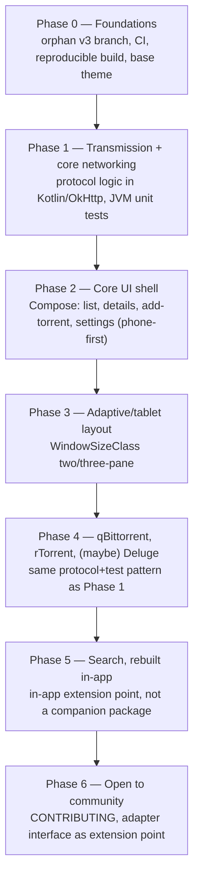

# Transdroid 3: Rewrite Plan

## Context

I am planning to start on Transdroid 3. It will be a full rewrite and redesign.

- The networking stack of Transdroid 2 is ancient and still uses the legacy Apache http client API (via org.apache.http.legacy).
- The UI is showing age and uses layers of patches upon old appcompat components that frequency break (such as the app bars recently).
- We rely on unsupported and unmaintained libraries such as androidannotations, ormlite and very old UI components.
- We still use deprecated XML layouts which get no love, and Java which no-one loves.
- There are many features poorly which might or might not work any more (search module content provider, broken tablet layout, several totally untested torrent client adapters).

A fresh start should:

- Use modern language, tooling, libraries (Kotlin, Compose UI, okhttp...)
- Focus again on most-used, most-loved, most-wanted features and clients
- Have proper CI/CD, releases on F-Droid
- Be more secure
- Have a functional and adaptive yet attractive UI
- Make it fun to work in the code base

## Design

We will keep the **dark grey-green branding** but adopt a platform-fitting Material 3 UI. Will support anything from small pgones to foldables, tablets and large screens.

## Repo & branching

Build on an **orphan `v3` branch of the existing repo** — not a new repository.

- `git checkout --orphan v3` — no shared history or file tree with `master`, so it's structurally a clean slate with zero risk of legacy code leaking in.
- `master` stays in maintenance mode (security/critical fixes only) for Transdroid 2 while `v3` is developed in parallel.
- Label issues `transdroid2` / `transdroid3`; add a short README banner clarifying `master` (stable v2) vs. `v3` (in development) while both exist.
- When `v3` is ready to ship as the primary app (around Phase 6), promote it to the default branch so the update-check URL keeps resolving, and tag the last v2 commit (e.g. `transdroid2-final`).

## Distribution

Ship on **F-Droid (reproducible build, hard requirement) and Google Play in parallel, same feature set on both**. Reuse the existing `full`/`lite` product-flavor split (`app/src/full`, `app/src/lite`) — it's already purely resource-driven with no Firebase/GMS dependency in either flavor, and `lite` already gates `search_available`/`updatecheck_available`/`rss_available` via `bools.xml`. Anything that genuinely can't ship identically on both stores goes behind a flavor-scoped bool the same way.

## Tech stack

- **UI**: Jetpack Compose with stock Material 3 (Apache 2.0, AndroidX, no F-Droid license concerns) as the component/theming base. Custom grey-green design system layered on top via color scheme/shape/typography token overrides, rather than Google's Material You dynamic-color defaults — while still keeping system integration (dynamic type, predictive back, dark theme).
- **Networking**: OkHttp directly, no Retrofit. The daemon protocols are heterogeneous (Transmission's JSON-RPC, qBittorrent's REST/cookie-auth API, rTorrent's SCGI/XML-RPC, Deluge's JSON-RPC), so a declarative-endpoint library adds friction for the non-REST ones. kotlinx.serialization for JSON.
- **Persistence — general settings**: DataStore for non-sensitive app preferences. Room only if structured local storage is actually needed beyond that; a flat rolling log file (with redaction, see below) likely replaces the current single-table ORMLite error log.
- **Persistence — server profiles (sensitive data)**: server connection profiles hold IPs, ports, usernames, passwords, and API keys/secrets, and their shape varies and evolves per client type — a relational schema is the wrong fit.
  - Model each profile as a flexible string-keyed map (JSON object) rather than fixed columns, so adding/removing fields per adapter never needs a migration.
  - Encrypt the serialized blob with AES-GCM using a key held in the Android Keystore (hardware/StrongBox-backed where available — broadly supported at minSdk 29).
  - Persist via a DataStore with a custom `Serializer` that encrypts on write / decrypts on read.
  - Do not use `androidx.security.crypto`'s `EncryptedSharedPreferences` — deprecated in `security-crypto:1.1.0-alpha07` (April 2025) over keystore-corruption and main-thread performance issues on certain OEMs. If hand-rolled AES-GCM feels like too much crypto surface to own, evaluate Google Tink's `StreamingAead` wrapped in the same `Serializer` pattern instead.
  - Exclude this store from Android auto-backup (`dataExtractionRules`) — the Keystore key doesn't survive device transfer/reinstall, so a backed-up encrypted blob is dead weight and credentials shouldn't leave the device via backup.
  - Redact profile fields from the error-log feature and crash reports.
- **Concurrency**: Kotlin coroutines + Flow, replacing AsyncTask/manual threading.
- **DI**: keep it light — Koin or manual constructor injection. Skip Hilt's codegen ceremony for a solo-first phase.
- **Min/target SDK**: minSdk 29 (up from 21), dropping legacy compat code (older permission models, pre-scoped-storage handling) from day one.

## Client adapter scope

Support **Transmission first**, then **qBittorrent and rTorrent**, then **possibly Deluge**. The remaining adapters (Aria2c, BitComet, Bitflu, BuffaloNas, DLinkRouterBT, KTorrent, Synology, Tfb4rt, TTorrent, uTorrent, Vuze) are dropped from `v3`'s initial scope — revisit only if community contributors want to pick one up post-Phase 6.

## Search

Dropped for v1 — matches how the `lite` flavor already behaves. Rebuild it later as a proper in-app extension point (search providers as a pluggable implementation inside the app), not a revival of the separate companion-package/`ContentProvider` pattern.

## Roadmap

**Phase 0 — Foundations**
`git checkout --orphan v3`; GitHub Actions CI scoped to the `v3` branch (build + lint + test on every push/PR); reproducible-build setup validated against F-Droid's expectations (pinned dependency versions, no network access mid-build beyond declared repos, no proprietary blobs); base Compose theme with the grey-green identity; the `full`/`lite` flavor split carried over from day one; `transdroid2`/`transdroid3` issue labels; README banner clarifying `master` vs. `v3`.

**Phase 1 — Transmission + core networking**
Port Transmission's protocol logic to Kotlin + OkHttp, with JVM unit tests using recorded fixture responses — pure protocol/parsing code with no Android dependency, the easiest place to introduce a testing discipline that never existed before. Validates the core adapter abstraction before a second client is built against it.

**Phase 2 — Core UI shell**
Compose screens for torrent list, torrent details, add-torrent, and settings — phone-first.

**Phase 3 — Adaptive/tablet layout**
A `WindowSizeClass`-driven adaptive layout, replacing the three-XML-files-per-breakpoint pattern with one composable that adapts pane count explicitly by width class.

**Phase 4 — qBittorrent, rTorrent, then maybe Deluge**
Same protocol + fixture-based unit test pattern as Phase 1.

**Phase 5 — Search, rebuilt in-app**
Design as an in-app extension point, not a separate companion package.

**Phase 6 — Open to community**
Once the core (networking + 2-3 screens + a handful of adapters) is stable: publish CONTRIBUTING docs, define the adapter interface as the extension point for new clients, tag good-first-issues.
